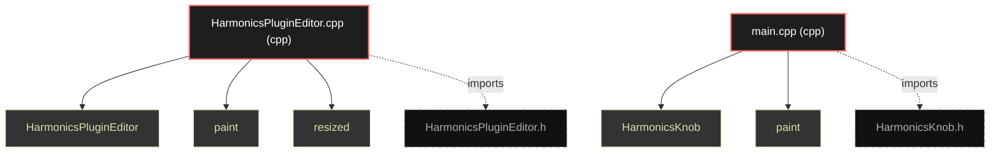

# Polyglot Codebase Knowledge Graph

> Generated offline by **readmenator**. Supports C, C++, Python, Go, Rust, JS/TS, Java, C#, Shell, PHP, Dart, GDScript, Nim, ASM.
> No LLMs. No tokens. Pure static analysis. See more [here](https://github.com/grisuno/ReadMenator)

**Total Files Parsed:** 2 | **Total Symbols Extracted:** 5 | **Total Imports:** 2

## Structural Knowledge Map

---

## Architecture Reference

### CPP (2 files)

#### `HarmonicsPluginEditor.cpp`
**Path:** `HarmonicsPluginEditor.cpp`

**Functions:**
- `HarmonicsPluginEditor` (line 3) `HarmonicsPluginEditor::HarmonicsPluginEditor(HarmonicsPluginProcessor& p)
    : AudioProcessorEdi...` - *HarmonicsPluginEditor.cpp include "HarmonicsPluginEditor.h"*
- `paint` (line 18) `void HarmonicsPluginEditor::paint(Graphics& g)`
- `resized` (line 23) `void HarmonicsPluginEditor::resized()`

#### `main.cpp`
**Path:** `main.cpp`

**Functions:**
- `HarmonicsKnob` (line 2) `HarmonicsKnob::HarmonicsKnob()` - *include "HarmonicsKnob.h"*
- `paint` (line 14) `void HarmonicsKnob::paint(Graphics& g)`
