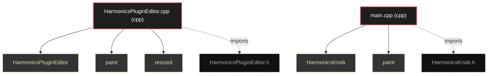

# Polyglot Codebase Knowledge Graph

> Generated offline by **readmenator**. Supports C, C++, Python, Go, Rust, JS/TS, Java, C#, Shell, PHP, Dart, GDScript, Nim, ASM, Ruby, Swift, Kotlin, Scala, Lua, Elixir.
> No LLMs. No tokens. Pure static analysis. See more [here](https://github.com/grisuno/ReadMenator)

**Total Files Parsed:** 2 | **Total Symbols Extracted:** 5 | **Total Imports:** 2

<!-- ranking_model: v1.0 | weights: {ppr:0.45,auth:0.2,test:0.15,doc:0.1,fresh:0.1} | alpha:0.85 | commit:4c8e0d2 | date:2026-07-18 -->


## Table of Contents

1. [Statistics Dashboard](#statistics-dashboard)
2. [Architectural Layers](#architectural-layers)
3. [Ranked Context](#ranked-context)
4. [God Nodes](#god-nodes)
5. [Suggested Questions](#suggested-questions)
6. [Hotspot Analysis](#hotspot-analysis)
7. [Change Impact Analysis](#change-impact-analysis)
8. [Suggested Linting Rules](#suggested-linting-rules)
9. [Query Recipes](#query-recipes)
10. [Structural Knowledge Map](#structural-knowledge-map)
11. [UML Class Diagram](#uml-class-diagram)
12. [Code Property Graph](#code-property-graph)
13. [Architecture Reference](#architecture-reference)
    - [CPP (2 files)](#cpp-2-files)

---

## Statistics Dashboard

| Metric | Value |
|--------|-------|
| Total Files | 2 |
| Total Symbols | 5 |
| Total Imports | 2 |
| Call Edges | 0 |
| Inheritance Edges | 0 |
| Languages | 1 |
| Avg Symbols/File | 2.5 |
| Avg Imports/File | 1.0 |

### Top Files by Import Count (Fan-Out)

| File | Imports | Symbols | Language |
|------|---------|---------|----------|
| `HarmonicsPluginEditor.cpp` | 1 | 3 | cpp |
| `main.cpp` | 1 | 2 | cpp |

---

## Architectural Layers

Auto-detected from path patterns, naming conventions, and imported frameworks.

| Layer | Files |
|-------|-------|
| infrastructure | 1 |
| utility | 1 |

### infrastructure

- `HarmonicsPluginEditor.cpp` (cpp, 3 symbols)

### utility

- `main.cpp` (cpp, 2 symbols)

---

## Ranked Context

Files ranked by composite score for the current query context. The ranking combines Personalized PageRank (query relevance), global authority, test coverage, documentation coverage, and code freshness. Model: v1.0.

| Rank | File | Composite | PPR | Authority | Test | Doc |
|------|------|-----------|-----|-----------|------|-----|
| 1 | `main.cpp` | 0.1000 | 0.0000 | 0.0000 | 0.00 | 1.00 |
| 2 | `HarmonicsPluginEditor.cpp` | 0.0667 | 0.0000 | 0.0000 | 0.00 | 0.67 |

---

## God Nodes

Most architecturally central files ranked by combined import/export degree and symbol richness.

| File | Score | Connections | PageRank |
|------|-------|-------------|----------|
| `HarmonicsPluginEditor.cpp` | 0.3 | | 0.0000 |
| `main.cpp` | 0.2 | | 0.0000 |

---

## Suggested Questions

Auto-generated exploration prompts based on graph structure:

- What does HarmonicsPluginEditor.cpp depend on, and what depends on it? (0 connections)
- What does main.cpp depend on, and what depends on it? (0 connections)
- What is the overall architecture of this codebase?

---

## Hotspot Analysis

Files ranked by combined complexity (symbol count) and centrality (connection count). High-scoring files are architecturally critical and may need refactoring attention.

| File | Complexity | Centrality | Combined | Symbols | Connections |
|------|-----------|------------|----------|---------|-------------|
| `main.cpp` | 0.667 | 1.000 | 0.867 | 2 | 1 |
| `HarmonicsPluginEditor.cpp` | 1.000 | 1.000 | 1.000 | 3 | 1 |

---

## Change Impact Analysis

Files sorted by how many other files would be affected if they changed. High-impact files should be changed with caution.

| File | Direct Dependents | Transitive Dependents | Total Impact |
|------|------------------|----------------------|--------------|
| `HarmonicsPluginEditor.cpp` | 0 | 0 | 0 |
| `main.cpp` | 0 | 0 | 0 |

---

## Suggested Linting Rules

Automatically suggested linting and security rules based on patterns detected in the codebase. These can be exported as Semgrep rules using the `--export-rules` flag.

| Rule ID | Severity | Description | Language | Matches |
|---------|----------|-------------|----------|---------|
| `RM001` | info | Large number of functions in cpp: 5 total | cpp | 5 |

---

## Query Recipes

Example queries you can run against this knowledge base using the ranking engine:

```
# Find files most relevant to a concept
readmenator query "Where is the import resolver implemented?"

# Rank files by relevance to a topic
readmenator query "How does documentation generation work?"

# Explain why a file ranks highly
readmenator query "explain readmenator/_documentation.py"

# Trace dependency paths with ranked context
readmenator query "path from CLI to exporter"
```

The ranking model uses the following signals:

- **Personalized PageRank** (45% weight): query-specific relevance via seed propagation
- **Global Authority** (20% weight): structural importance via standard PageRank
- **Test Coverage** (15% weight): fraction of symbols referenced in test files
- **Doc Coverage** (10% weight): presence of docstrings and file-level docs
- **Freshness** (10% weight): recent modification activity

Results include score decomposition and justification paths for each ranked item.

---

## Structural Knowledge Map



---

## Code Property Graph

Machine-readable Code Property Graph (CPG) in JSON-LD format. This block allows AI agents to parse the full structural graph without additional file reads. Compatible with GraphRAG pipelines.

```json
{"@context": "https://schema.org", "analysis": {"communities": [], "god_nodes": [{"node_id": "HarmonicsPluginEditor.cpp", "score": 0.3}, {"node_id": "main.cpp", "score": 0.2}], "surprising_connections": []}, "edges": [{"confidence": "EXTRACTED", "relation": "imports", "source": "HarmonicsPluginEditor.cpp", "target": "HarmonicsPluginEditor.h"}, {"confidence": "EXTRACTED", "relation": "imports", "source": "main.cpp", "target": "HarmonicsKnob.h"}], "generator": "readmenator", "metadata": {"edge_count": 2, "file_count": 2, "language_count": 1, "symbol_count": 5}, "nodes": [{"doc": "HarmonicsPluginEditor.cpp include \"HarmonicsPluginEditor.h\"", "id": "HarmonicsPluginEditor.cpp", "kind": "module", "label": "HarmonicsPluginEditor.cpp", "language": "cpp", "sha256": "05955ad05b1b6234", "symbol_count": 3, "symbols": [{"doc": "HarmonicsPluginEditor.cpp include \"HarmonicsPluginEditor.h\"", "kind": "function", "line": 3, "name": "HarmonicsPluginEditor", "signature": "HarmonicsPluginEditor::HarmonicsPluginEditor(HarmonicsPluginProcessor& p)\n    : AudioProcessorEdi..."}, {"kind": "function", "line": 18, "name": "paint", "signature": "void HarmonicsPluginEditor::paint(Graphics& g)"}, {"kind": "function", "line": 23, "name": "resized", "signature": "void HarmonicsPluginEditor::resized()"}]}, {"doc": "include \"HarmonicsKnob.h\"", "id": "main.cpp", "kind": "module", "label": "main.cpp", "language": "cpp", "sha256": "1e266e5811852886", "symbol_count": 2, "symbols": [{"doc": "include \"HarmonicsKnob.h\"", "kind": "function", "line": 2, "name": "HarmonicsKnob", "signature": "HarmonicsKnob::HarmonicsKnob()"}, {"kind": "function", "line": 14, "name": "paint", "signature": "void HarmonicsKnob::paint(Graphics& g)"}]}], "type": "CodePropertyGraph", "version": "1.0"}
```

---

## Architecture Reference

### CPP (2 files)

#### `HarmonicsPluginEditor.cpp`
**Path:** `HarmonicsPluginEditor.cpp`
**File Doc:** *HarmonicsPluginEditor.cpp include "HarmonicsPluginEditor.h"*

**Functions:**
- `HarmonicsPluginEditor` (line 3) `HarmonicsPluginEditor::HarmonicsPluginEditor(HarmonicsPluginProcessor& p)
    : AudioProcessorEdi...` - *HarmonicsPluginEditor.cpp include "HarmonicsPluginEditor.h"*
- `paint` (line 18) `void HarmonicsPluginEditor::paint(Graphics& g)`
- `resized` (line 23) `void HarmonicsPluginEditor::resized()`

#### `main.cpp`
**Path:** `main.cpp`
**File Doc:** *include "HarmonicsKnob.h"*

**Functions:**
- `HarmonicsKnob` (line 2) `HarmonicsKnob::HarmonicsKnob()` - *include "HarmonicsKnob.h"*
- `paint` (line 14) `void HarmonicsKnob::paint(Graphics& g)`
